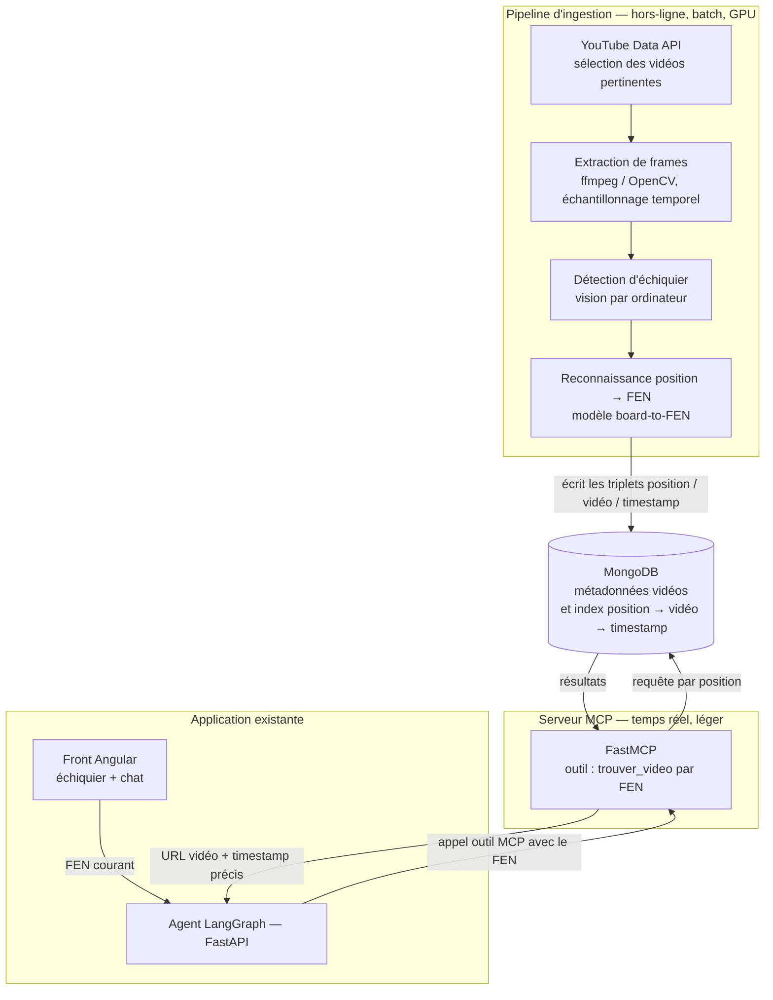

# Architecture technique — Système vidéo → FEN (solution MCP)

## Contexte

La recherche de vidéos actuelle est **textuelle** : une requête « défense
sicilienne » renvoie une vidéo entière, sans garantie de pertinence ni de
précision. L'objectif du système étudié est d'**indexer les vidéos par les
positions d'échecs qu'elles affichent réellement**, afin de retrouver, pour une
position donnée (FEN), la **vidéo et le timestamp exact** où cette position
apparaît.

Le système est exposé via un **serveur MCP** (Model Context Protocol), ce qui le
rend modulaire et réutilisable par l'agent existant comme par d'autres
applications.

## Schéma d'architecture

## Principe directeur : deux blocs découplés

L'architecture sépare volontairement le **traitement lourd** du **service temps
réel**. C'est le choix structurant de la solution.

### 1. Pipeline d'ingestion (hors-ligne, batch)

Exécuté périodiquement, jamais pendant une requête utilisateur. Il transforme
des vidéos en données interrogeables :

- **Collecte** — sélection des vidéos pertinentes via la YouTube Data API ;
  stockage des métadonnées dans MongoDB.
- **Extraction de frames** — échantillonnage temporel des images (ffmpeg /
  OpenCV), par exemple une image par seconde ou sur détection de changement de
  plan, pour limiter le volume.
- **Détection d'échiquier** — sur chaque frame, déterminer la présence d'un
  échiquier et le localiser (vision par ordinateur).
- **Reconnaissance position → FEN** — sur l'échiquier détecté, produire la
  notation FEN de la position (modèle *board-to-FEN* ; cf. ressource `fenify-3D`
  pour les plateaux en perspective).

Ce bloc est le poste de calcul (GPU) et le principal facteur de coût et de
précision — il est traité en détail dans les livrables « bénéfices/limites » et
« étude de coûts ».

### 2. Stockage (MongoDB)

Cœur de données du système : métadonnées des vidéos et **index des triplets**
`(position FEN, vidéo, timestamp)`. C'est ce que le serveur MCP interroge. Le
choix de MongoDB est cohérent avec la pile déjà imposée par le projet.

### 3. Serveur MCP (temps réel, léger)

Construit avec **FastMCP**, il expose une capacité unique côté requête :
`trouver_video(fen) → URL vidéo + timestamp`. Il ne fait aucun calcul de vision ;
il ne fait que consulter l'index. C'est ce découplage qui permet une réponse
rapide malgré la lourdeur du pipeline en amont.

### 4. Consommation par l'application existante

L'agent LangGraph consomme le serveur MCP comme un **outil supplémentaire**, au
même titre que Lichess, Stockfish, le RAG et la recherche YouTube actuelle.
L'intégration est non intrusive : le front envoie le FEN courant, l'agent
interroge le MCP, et reçoit un lien horodaté au lieu d'une vidéo entière.

## Flux d'une requête utilisateur

1. L'utilisateur atteint une position sur l'échiquier ; le front transmet le
   **FEN** à l'agent.
2. L'agent appelle l'outil MCP `trouver_video(fen)`.
3. Le serveur MCP interroge l'index MongoDB par position.
4. Il renvoie la **vidéo et le timestamp** correspondants.
5. L'agent présente à l'utilisateur un lien pointant directement sur le passage
   pertinent.

## Choix structurants (à défendre)

- **Découplage ingestion / service** : la charge de vision par ordinateur est
  isolée en batch ; le chemin temps réel reste léger et rapide.
- **Exposition via MCP** : interopérabilité et modularité — le système est
  réutilisable au-delà de cet agent, et remplaçable sans toucher à l'agent.
- **Réutilisation de la pile du projet** : MongoDB (imposé), FastMCP et un
  modèle board-to-FEN (ressources citées dans la mission).

> Livrables associés (à venir) : *note sur les bénéfices attendus et les
> limites* et *étude de faisabilité avec estimation des coûts*.
